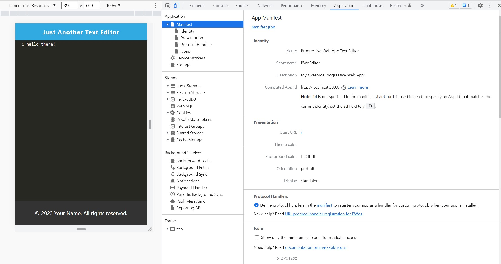
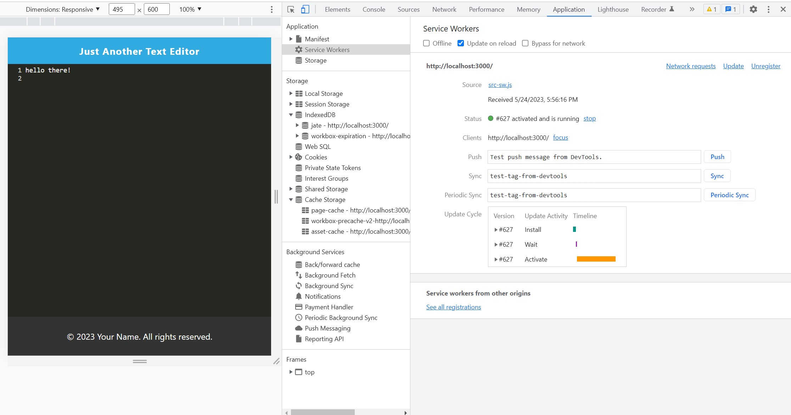

# PWA-Text-Editor

## Description

[Visit the Deployed Site]()
<br>
Here, my task was to build a text editor that runs in the browser. The app is a single-page application that meets the PWA criteria. Additionally, it features a number of data persistence techniques that serve as redundancy in case one of the options is not supported by the browser. The application also functions offline.
To build this text editor, I started with an existing application and implemented methods for getting and storing data to an IndexedDB database. I used a package called idb, which is a lightweight wrapper around the IndexedDB API. It features a number of methods that are useful for storing and retrieving data, and is used by companies like Google and Mozilla.

Lastly, I have deployed this full-stack application to Heroku.

<br>
<br>


## Technology Used 

| Technology Used         | Resource URL           | 
| ------------- |:-------------:|    
| Git | [https://git-scm.com/](https://git-scm.com/)     |  
| JavaScript | [https://developer.mozilla.org/en-US/docs/Web/JavaScript](https://developer.mozilla.org/en-US/docs/Web/JavaScript) |  
| NodeJs | [https://nodejs.org/en](https://nodejs.org/en) |
| ExpressJS | [https://www.npmjs.com/package/express](https://www.npmjs.com/package/express) |
| Insomnia | []() |
| MongoDB | []() |
| Mongoose ODM | []() |


<br>
<br>


## Table of Contents

* [Installation](#installation)
* [Application Highlights and Usage](#application-highlights-and-usage)
* [Code Snippets](#code-snippets)
* [Learning Points](#learning-points)
* [Author Info](#author-info)
* [Credits](#credits)

<br>
<br>


## Installation

The 'NoSQL Social Network API' requires installation of mongoDB, and express-ja and mongoose NPM packages.
 After cloning down the repository, go to the command-line in the terminal and do an 'npm install' to install all the dependencies stated in the 'package.json' file and run 'npm run start' or 'npm run develop' to start the server.
<br>
<br>
<br>

## Application Highlights and Usage
<br>


1. The following GIF shows when I click on the Install button, then I can download my web application as an icon on my desktop:
<br>
<br>


<br>
<br>
2. The following image shows the applications manifest file:
<br>
<br>




<br>
<br>
3. The following image shows the application's registered service worker:
<br>
<br>




<br>
<br>


## Code Snippets

<br>

 The following code snippet shows the use of Regular expressions(regex) to validate an email address in User.js: 

```javascript

```

<br>
<br>

The following code snippet shows how Mongoose was set up with local server in connection.js:

```javascript

```


## Learning Points 

   I learned the following skills while doing this project:
<br>
- Java script basics (variables,functions, arrays, for-loops, if-else etc)
- Basics of NodeJs server and related functions
- How to write API routes with MongoDb as the database instead of using MySQL queries
- Using the express and mongoose packages from NPM 
- Creating collections using MongoDB and their associations to create relationships between collections using mongoose.


<br>
<br>

## Author Info

### Aarti Contractor


- Portfolio: https://aarticontractor.github.io/aarticontractor_portfolio/
- Linkedin: https://www.linkedin.com/in/aarti-contractor/
- Github: https://github.com/aarticontractor

<br>

## Credits

- https://developer.mozilla.org/en-US/docs/Web/JavaScript
- https://cloudconvert.com/webm-to-gif
- https://nodejs.org/en
- https://www.npmjs.com/package/express
- 


<br>

© 2023 edX Boot Camps LLC. Confidential and Proprietary. All Rights Reserved.